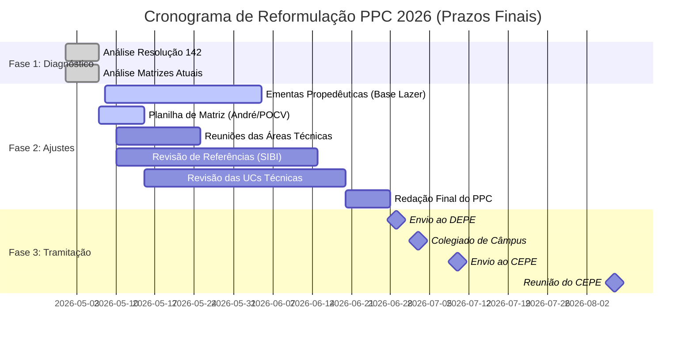

# Guia de Reformulação: PPCs Técnico Integrado (INF e ADM)

Este documento centraliza o planejamento, o status atual e o cronograma de atividades para a reformulação dos Projetos Pedagógicos de Curso (PPCs) dos cursos de Informática e Administração do IFSC Garopaba, em conformidade com a **Resolução CONSUP/IFSC nº 142/2025**.

---

## 1. Status de Conformidade (Resumo)

Atualmente, ambos os cursos possuem carga horária total e de formação geral adequadas, mas necessitam de ajustes pontuais em componentes específicos para atingir o mínimo de 120h exigido.

| Curso | CH Total | CH FG | Ajustes Críticos (Mínimos Res. 142) |
| :--- | :---: | :---: | :--- |
| **Informática** | 3.340h | 2.140h | Espanhol (+40h) |
| **Administração** | 3.140h | 2.140h | Inglês/Espanhol (+40h cada) |
| **Lazer (MODELO)** | 3.280h | 2.440h | Já adequado (Referência de Ementas) |

---

## 2. Referência Institucional: PPC Técnico em Lazer (Garopaba)

O novo PPC de Lazer (Resolução CEPE/IFSC nº 28/2025) serve como modelo de unificação para o campus. Abaixo, o comparativo das cargas horárias da Formação Geral:

| Componente | Lazer (Modelo) | INF (Atual) | ADM (Atual) | Diferença/Impacto |
| :--- | :---: | :---: | :---: | :--- |
| Português / Literatura | 240h | 280h | 280h | Possível redução para unificar |
| Matemática | 240h | 280h | 280h | Possível redução para unificar |
| Inglês | **200h** | 120h | 80h | **Lacuna significativa** |
| Espanhol | **200h** | 80h | 80h | **Lacuna significativa** |
| História / Geografia | 160h | 160h | 160h | Compatível |
| Física / Química | 200h | 200h | 200h | Compatível |
| Biologia | 160h | 160h | 160h | Compatível |
| Filo / Socio | 160h | 120h | 120h | Lazer possui +40h em cada |
| Projeto Integrador | **240h** | 120h | 120h | **Lazer possui o dobro de PI** |

### Proposta de Padronização: Técnico em Informática
| Componente | Atual | Modelo | A1 | A2 | A3 | Impacto |
| :--- | :---: | :---: | :---: | :---: | :---: | :--- |
| L. Portuguesa / Lit. | 280h | 240h | 80h | 80h | 80h | Reduzir 40h |
| Matemática | 280h | 240h | 80h | 80h | 80h | Reduzir 40h |
| Inglês | 120h | 200h | 80h | 80h | 40h | **+80h** |
| Espanhol | 80h | 200h | 80h | 40h | 80h | **+120h** |
| Filo / Socio | 240h | 320h | 160h | 160h | 0h | **+80h** |
| Projeto Integrador | 120h | 240h | 80h | 80h | 80h | **+120h** |
| **Formação Geral (Total)** | **2.140h** | **2.600h** | **880h** | **860h** | **860h** | **+460h** |
| Formação Técnica | 1.200h | 1.200h | 360h | 400h | 440h | Manter |
| **Total do Curso** | **3.340h** | **3.800h** | **1.240h** | **1.260h** | **1.300h** | **Necessário 4 anos?** |

### Proposta de Padronização: Técnico em Administração
| Componente | Atual | Modelo | A1 | A2 | A3 | Impacto |
| :--- | :---: | :---: | :---: | :---: | :---: | :--- |
| L. Portuguesa / Lit. | 280h | 240h | 80h | 80h | 80h | Reduzir 40h |
| Matemática | 280h | 240h | 80h | 80h | 80h | Reduzir 40h |
| Inglês / Espanhol | 160h | 400h | 160h | 120h | 120h | **+240h** |
| Filo / Socio | 240h | 320h | 160h | 160h | 0h | **+80h** |
| Projeto Integrador | 120h | 240h | 80h | 80h | 80h | **+120h** |
| **Formação Geral (Total)** | **2.140h** | **2.600h** | **880h** | **860h** | **860h** | **+460h** |
| Formação Técnica | 1.000h | 1.000h | 180h | 260h | 560h | Manter |
| **Total do Curso** | **3.140h** | **3.600h** | **1.060h** | **1.120h** | **1.420h** | **No limite (3 anos)** |

> [!TIP]
> **Estratégia de Reunião:** O modelo de Lazer sugere um fortalecimento das Línguas Estrangeiras e do Projeto Integrador, compensado por uma leve redução em Português e Matemática (mantendo-os acima dos mínimos legais).

---

## 3. Tarefas e Frentes de Trabalho

As atividades foram divididas em quatro eixos principais:

### A. Propedêutica (Base Comum)
*   **Ação:** Criar ementas unificadas para os dois cursos.
*   **Foco:** Adotar como referência a carga horária do **PPC Lazer** para garantir padronização institucional.
*   **Responsáveis:** Docentes das áreas de Formação Geral.

### B. Técnica (Específica)
*   **Ação:** Reavaliar todas as Unidades Curriculares (UCs) técnicas.
*   **Foco:** Revisar o Perfil do Egresso e a aderência ao Catálogo Nacional de Cursos Técnicos (CNCT).
*   **Responsáveis:** Coordenadorias de Curso e Núcleos Docentes Estruturantes (NDE).

### C. Integração e Metodologia (Transversal)
*   **Ação 1:** Reavaliar o formato do **Projeto Integrador (PI)** (Art. 7º, III).
*   **Ação 2 (Desejável):** Prever integrações de conteúdo entre UCs da mesma fase (interdisciplinaridade).

### D. Decisões Estratégicas (Comissão)
*   **Duração:** Definição final entre **3 ou 4 anos**.
*   **Turnos:** Organização dos turnos por semestre.
*   **PI:** Definição do formato (Oficinas, Projetos, etc.).
*   **Horas Complementares:** Avaliar necessidade/obrigatoriedade (presente em alguns PPCs).

---

## 4. Registro de Reuniões e Decisões

### 1ª Reunião da Comissão (07/05/2026)
*   **Apresentação do Diagnóstico:** O pipeline e o comparativo com o PPC Lazer foram validados pela comissão.
*   **Diretriz Propedêutica:** Decidido buscar a padronização de ementas com o curso de Lazer (ex: Inglês) para facilitar a mobilidade e validação de pendências entre cursos.
*   **Foco na Prática:** Identificada a necessidade de antecipar experiências técnicas práticas (hoje muito concentradas no final dos cursos).
*   **Matemática:** Discussão sobre carga horária real vs. nominal e possibilidade de nivelamento.
*   **Referências Bibliográficas:** A biblioteca do campus assumirá a revisão e atualização das referências.

---

## 5. Datas de Referência e Prazos (Fluxo Oficial)

Conforme comunicado oficial (DEPE), os prazos para garantir a oferta em **2027.1** são:

*   **Envio ao DEPE:** até 29/06
*   **Reunião do Colegiado de Câmpus:** 03/07 (a confirmar)
*   **Envio ao CEPE:** até 10/07
*   **Reunião do CEPE:** 06 e 07/08

> [!IMPORTANT]
> **Restrição de Alterações:** Elementos como **nome do curso, turno, duração, quantitativo de vagas e forma de ingresso** não devem ser alterados neste momento, pois serão encaminhados à DEING em julho. Foco total em **cargas horárias e ementas**.

---

## 5. Timeline de Execução (Atualizada)

---

## 6. Links de Referência
*   **Materiais PPC Lazer (Drive):** [Link Google Drive](https://drive.google.com/drive/folders/1A7zIGiHCl6T8P04eF6l-Jz9V69ENSiTv)
*   **PPCs Atuais e Informações:** [Página IFSC Garopaba](https://www.ifsc.edu.br/en/web/campus-garopaba/tecnicos-integrados)
*   [Resolução 142/2025 (PDF)](./Resoluo_142_Consup__Aprova_Diretrizes_Curriculares_Cursos_Tcnicos_Integrados_.pdf)
*   [Análise Detalhada Informática (PDF)](./TECNICO-INFORMATICA/analise_ppc_informatica.pdf)
*   [Análise Detalhada Administração (PDF)](./TECNICO-ADMINISTRACAO/analise_ppc_administracao.pdf)

---
*Documento gerado para auxiliar a Reunião de Comissão de 07/05/2026.*
